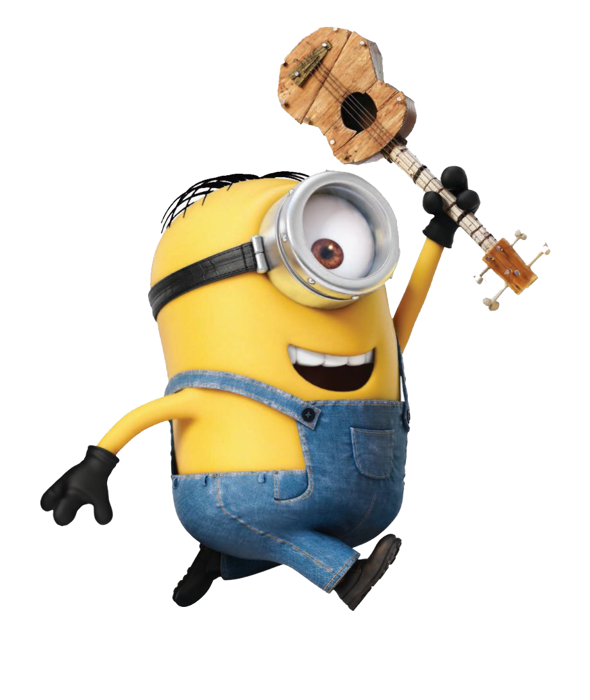

# **Minions: The Rise of Gru (2022)** 

#### Plot Summary


From the biggest global animated franchise in history, comes the origin story of how the world’s greatest supervillain first met his iconic Minions, forged cinema’s most despicable crew and faced off against the most unstoppable criminal force ever assembled in ***Minions: The Rise of Gru***.  

Long before he becomes the master of evil, Gru (Oscar® nominee [*Steve Carell*](https://en.wikipedia.org/wiki/Steve_Carell)) is just a 12-year-old boy in 1970s suburbia, plotting to take over the world from his basement. 
It’s not going particularly well. When Gru crosses paths with the Minions, including Kevin, Stuart, Bob, and Otto—a new Minion sporting braces and a desperate need to please—this unexpected family joins forces. Together, they build their first lair, design their first weapons, and strive to execute their first missions.  

When the infamous supervillain supergroup, the Vicious 6, oust their leader—legendary martial arts fighter Wild Knuckles (Oscar® winner [*Alan Arkin*](https://en.wikipedia.org/wiki/Alan_Arkin))— Gru, their most devoted fanboy, interviews to become their newest member. The Vicious 6 is not impressed by the diminutive, wannabe villain, but then Gru outsmarts (and enrages) them, and he suddenly finds himself the mortal enemy of the apex of evil. With Gru on the run, the Minions attempt to master the art of kung fu to help save him, and Gru discovers that even bad guys need a little help from their friends. 


:movie_camera: [Minions: The Rise of Gru - IMDB](https://www.imdb.com/title/tt5113044/)<br>
:tomato: [Minions: The Rise of Gru - Rotten Tomatoes](https://www.rottentomatoes.com/m/minions_the_rise_of_gru)<br>
<br>
```java
//Prints the title and year released to the console
public static void main(String[] args) {
    String name = "Minions: The Rise of Gru";
    String year = "(2022)";
    System.out.println(name + " " + year);
}
```
<br><br>

  <h1 style="color: yellow; text-align: center;">
    My rankings of the three main minions:
  </h1>
  <table cellspacing="10">
    <tr>
        <td> 
        <p style="font-size: 100px;"> 1 </p>
        </td>
        <td>
            
        </td>
        <td>
            <p style="font-size: 25px; text-align: center;"> Bob</p>
            <p style="font-size: 20px;">
            It's Bob the Minion, also known as King Bob. You can tell Bob apart from his “buddies” because he's short, bald, and has heterochromia (one green eye, one brown eye). Bob is the youngest of the minions (though minions are much older than all of us) and he's definitely the cutest.
            </p>
        </td>        
    </tr>
    <tr>
        <td> 
        <p style="font-size: 100px;"> 2 </p>
        </td>
        <td>
            
        </td>
        <td>
            <p style="font-size: 25px; text-align: center;"> Kevin</p>
            <p style="font-size: 20px;">
            Kevin loves to make fun of and tease people or Minions, shown when he made fun of Jerry and teased him for being a coward. He likes playing golf polo and cricket. Kevin has a sense of humor, shown when he thought it was hilarious to see Tom turn into a mutant purple minion, but then immediately showed a cautious side when he realized that he was next to be a victim.
            </p>
        </td>         
    </tr>
    <tr>
        <td> 
        <p style="font-size: 100px;"> 3 </p>
        </td>
        <td>
            
        </td>
        <td>
            <p style="font-size: 25px; text-align: center;"> Stuart</p>
            <p style="font-size: 20px;">
            Stuart is playful, friendly, intelligent and funny. He is skillful at video games like his friend Dave. He can also be the most sincere and innocent out of all the minions. He also seems to have a rebellious and obstreperous attitude. He is considered to be a slacker among the other Minions, preferring to chill out and play the ukulele than listen to the rules.
            </p>
        </td>         
    </tr>
  </table>
  <br>
